# LearningSteps Lockdown - Lab Report (Days 1 & 2)

**Student:** Lee Gal
**Date:** 01.09.26
**Module:** Module 3. Cloud
**Exercise:** LearningSteps Lockdown - Day 1 (Locking Down Management Access) & Day 2 (Encryption and a Web Application Firewall)

---

## 1. Summary of Findings

This exercise hardened the LearningSteps environment (a FastAPI application backed by PostgreSQL, deployed on Azure via Terraform) across its first two attack surfaces: management access (SSH) and public web access (HTTP/TLS/WAF). Day 1 replaced a wide-open, key-based SSH configuration with identity-based login via Microsoft Entra ID, and restricted network access to a single trusted IP address. Day 2 stood up the application's first public entry point, closed a plaintext HTTP gap with a real Let's Encrypt TLS certificate, and enabled a Web Application Firewall (CrowdSec, running the OWASP Core Rule Set) to block SQL injection and cross-site scripting (XSS) attempts.

The key result was not just completing the prescribed steps, but discovering two real, unplanned security findings along the way:

- **A WAF bypass.** A SQL injection payload using '+' to encode spaces ('id=1+UNION+SELECT...') passed through the WAF undetected in real time, while the logically identical payload using proper percent-encoding ('%20') was correctly blocked - demonstrating that signature-based WAFs are encoding-sensitive and do not guarantee protection against all representations of the same attack.
- **Real internet scanning traffic.** Unsolicited traffic was observed hitting the VM from an unrelated IP address (Contabo GmbH, France) within hours of the environment becoming public, using a spoofed, decade-old browser User-Agent string - direct evidence that any publicly reachable service is found and probed by automated actors almost immediately.

---

## 2. Tools & Environment

- **Operating System (client):** Windows 11
- **Cloud Provider:** Microsoft Azure
- **Infrastructure as Code:** Terraform
- **CLI Tools:** Azure CLI ('az'), PowerShell, OpenSSH for Windows, 'curl.exe'
- **Target VM:** Ubuntu 22.04 LTS ('vm-lee'), Azure Linux Virtual Machine
- **Identity:** Microsoft Entra ID (Azure AD) - Virtual Machine Administrator Login role
- **Reverse Proxy / Certificate Management:** NPMplus (Nginx Proxy Manager, extended build)
- **TLS Certificate Authority:** Let's Encrypt
- **Web Application Firewall:** CrowdSec (OWASP Core Rule Set, AppSec component)
- **Database:** Azure Database for PostgreSQL Flexible Server ('psql-lee')
- **Version Control:** Git / GitHub Desktop

---

## 3. Execution & Procedures

### Day 1 - Locking Down Management Access

**Goal:** replace static SSH key authentication with identity-based login via Entra ID, and restrict the network path to SSH to a single trusted IP address.

#### Step 1: Grant Entra ID VM Login Role and Authenticate

The VM was already provisioned with a system-assigned managed identity and the 'AADSSHLoginForLinux' extension by Terraform. The remaining prerequisite - granting the account the **Virtual Machine Administrator Login** RBAC role scoped to the VM resource - is not automated, since Owner/Contributor rights on the subscription do not by themselves permit OS-level login.

'''powershell
$VM_ID = az vm show --resource-group rg-lee --name vm-lee --query id -o tsv
az role assignment create --assignee lee.gal@cybersteps.onmicrosoft.com '
  --role "Virtual Machine Administrator Login" --scope $VM_ID
'''

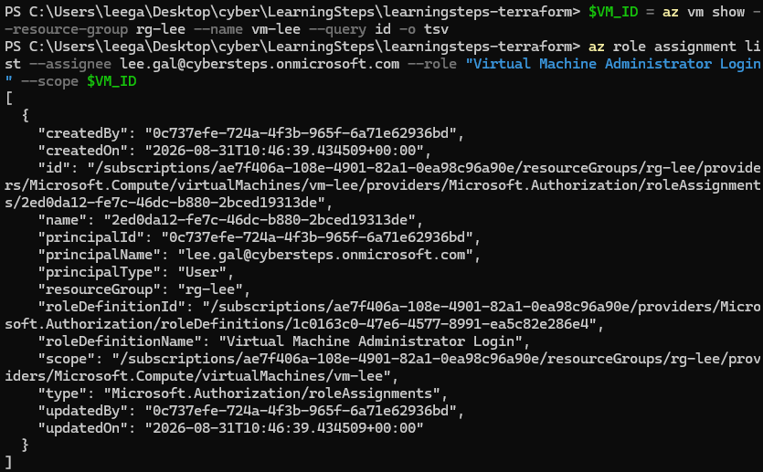
*Confirmation that the Virtual Machine Administrator Login role assignment landed correctly, scoped to vm-lee.*

Login was then performed using the Entra ID identity directly, with no SSH key file involved:

'''powershell
az ssh vm --resource-group rg-lee --name vm-lee
'''

*Successful SSH login to vm-lee authenticated via Entra ID identity rather than a static key.*

#### Step 2: Restrict SSH to a Trusted IP

The NSG's 'allow-ssh' rule initially permitted SSH (port 22) from any IP address ('"*"'), identified in 'network.tf' as the root cause of unrestricted management-plane exposure.

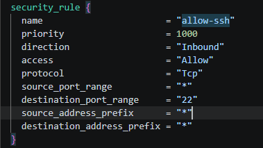
*network.tf before the change: source_address_prefix set to "*" - SSH reachable from any IP on the internet.*

The public IP was obtained and the rule updated to allow only that single address:

'''powershell
curl.exe -s -4 ifconfig.me
# -> e.g. 79.196.253.208

# network.tf
source_address_prefix = "79.196.253.208/32"
'''

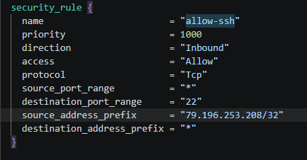
*network.tf after the change: source_address_prefix restricted to a single /32 address.*

'''powershell
terraform apply
'''

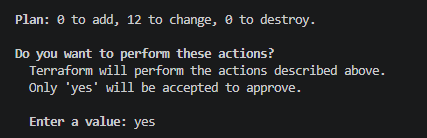
*Terraform plan showing only the NSG rule being modified in place.*

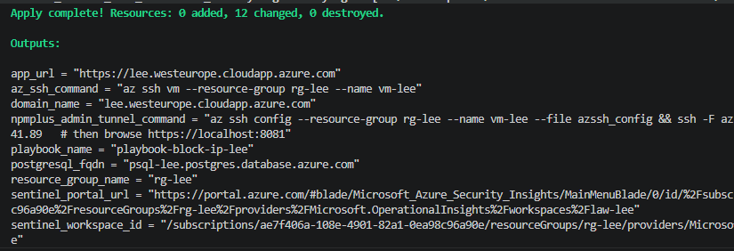
*Terraform apply completed successfully; the NSG rule is now restricted.*

> **Note:** the dynamic public IP changed between sessions (ISP-assigned), causing a connection timeout on a later day. This was diagnosed by re-running the 'ifconfig.me' check, comparing it against the currently allowed NSG rule, and re-applying with the new IP - a realistic operational consequence of IP-based allow-listing.

---

### Day 2 - Encryption and a Web Application Firewall

**Goal:** expose the application publicly for the first time, close the plaintext HTTP gap with real TLS, and add a Web Application Firewall to block known attack patterns before they reach the application.

#### Step 1: Confirm the App Is Alive, But Not Yet Exposed

Using the identity-verified SSH channel from Day 1, a local tunnel confirmed the FastAPI application was running correctly on the VM, without exposing it publicly:

'''powershell
az ssh config --resource-group rg-lee --name vm-lee --file azssh_config
ssh -F azssh_config -L 8000:localhost:8000 <vm-ip>
'''

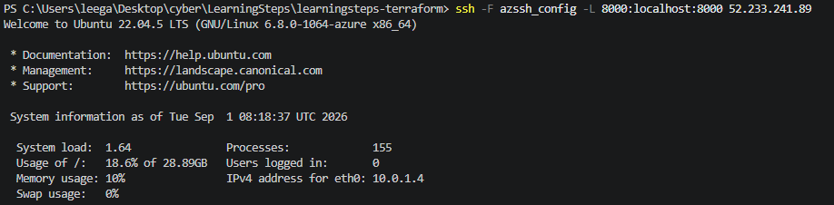
*SSH tunnel established from the local machine to the app's internal port (8000) on vm-lee.*

'''powershell
curl.exe http://localhost:8000/entries
'''

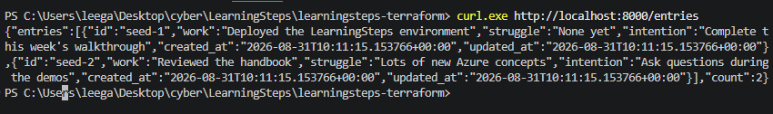
*Seeded journal entries returned as JSON, confirming the application itself is healthy while still unreachable from the public internet.*

#### Step 2: Create the Public Proxy Host

A Proxy Host was created in NPMplus mapping the VM's public FQDN to the application's internal address, with TLS deliberately left disabled at this stage:

- Domain: 'lee.westeurope.cloudapp.azure.com'
- Forward Hostname/IP: '127.0.0.1'
- Forward Port: '8000'

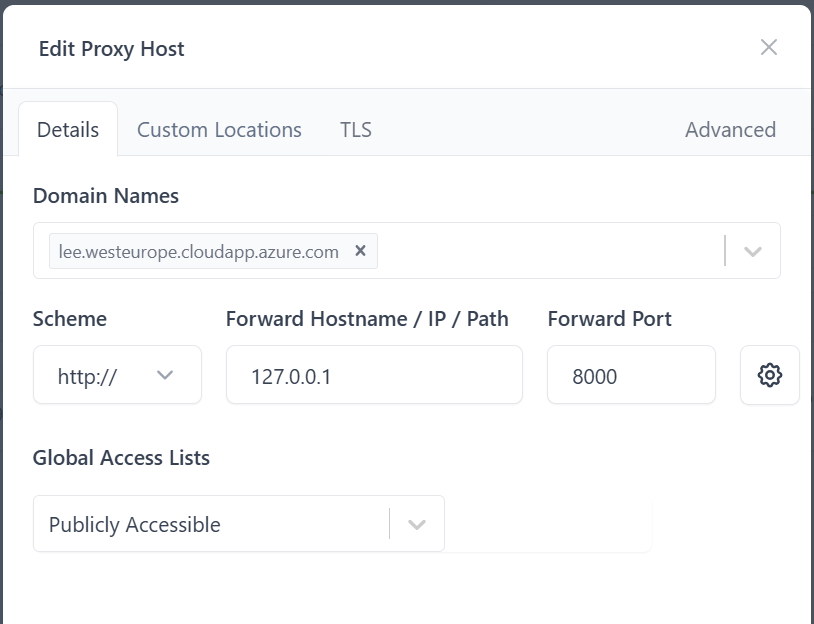
*Proxy Host configuration in NPMplus routing the public domain to the internal FastAPI application.*

#### Step 3: Confirm the Plaintext Gap

'''powershell
curl.exe -i "http://lee.westeurope.cloudapp.azure.com/entries"
'''

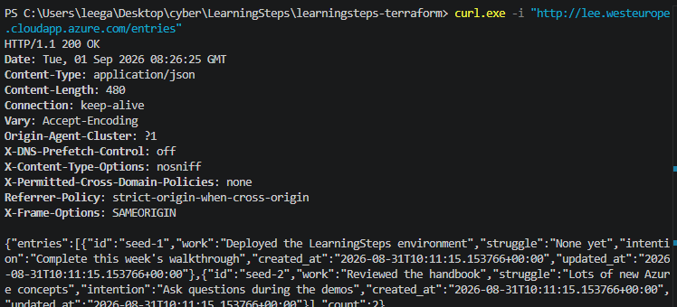
*200 OK returned over unencrypted HTTP - full JSON response readable by anything on the network path.*

#### Step 4: Enable Real TLS

A Let's Encrypt certificate was requested directly through the NPMplus TLS tab, with **Force HTTPS** enabled to redirect all plaintext traffic:

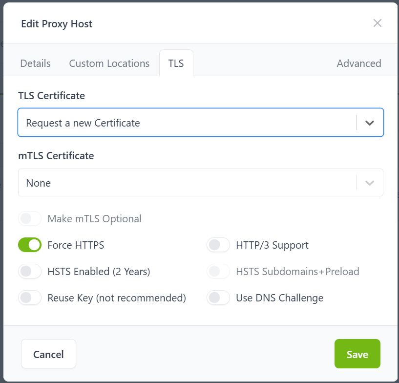
*NPMplus TLS tab: requesting a new Let's Encrypt certificate with Force HTTPS enabled.*

'''powershell
curl.exe -i https://lee.westeurope.cloudapp.azure.com/entries
curl.exe -i "http://lee.westeurope.cloudapp.azure.com/entries"
'''

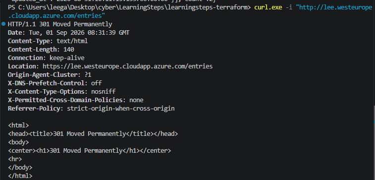
*301 Moved Permanently returned for the plain HTTP request, redirecting to HTTPS.*

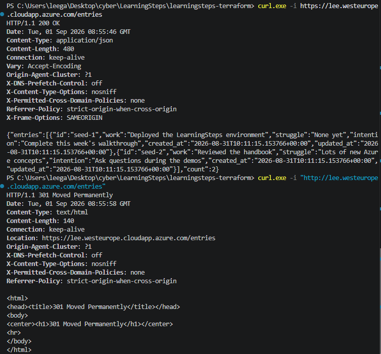
*Side-by-side confirmation: HTTPS returns 200 OK with a valid certificate; HTTP now redirects (301) instead of serving content directly.*

#### Step 5: Enable the Web Application Firewall

Before enabling the WAF, two known attack payloads were sent to confirm they passed through unobstructed:

'''powershell
curl.exe -i "https://lee.westeurope.cloudapp.azure.com/entries?id=1+UNION+SELECT+*+FROM+users"
curl.exe -i "https://lee.westeurope.cloudapp.azure.com/entries?q=%3Cscript%3Ealert(1)%3C%2Fscript%3E"
'''

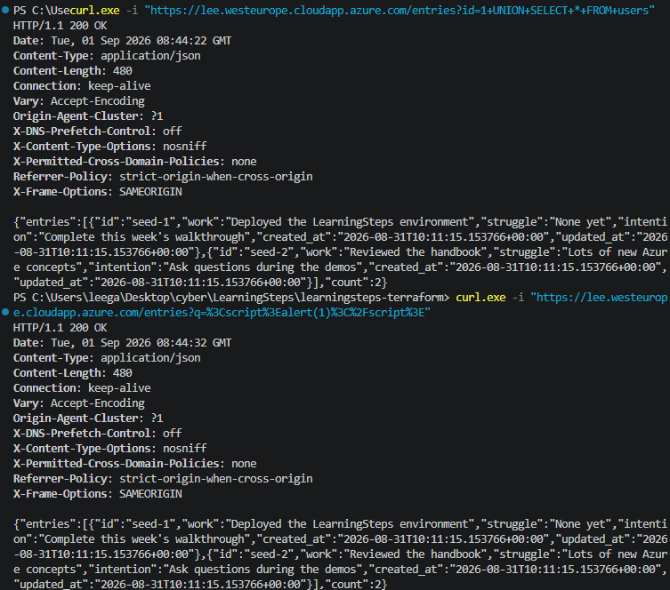
*Both a SQL injection payload and an XSS payload return 200 OK with no WAF active - the gap being demonstrated.*

CrowdSec's bouncer was registered against the NPMplus proxy:

'''bash
sudo docker exec crowdsec cscli bouncers add npmplus
'''

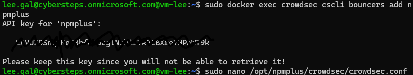
*CrowdSec bouncer registration, producing a one-time API key (redacted) used to authorize NPMplus to query CrowdSec's decision engine.*

The generated API key was inserted into the CrowdSec configuration, and the container restarted to apply it:

'''bash
sudo nano /opt/npmplus/crowdsec/crowdsec.conf
#   ENABLED=true
#   API_URL=http://127.0.0.1:8080
#   APPSEC_URL=http://127.0.0.1:7422
#   API_KEY=<redacted>

cd /opt/npmplus && sudo docker compose restart npmplus
'''

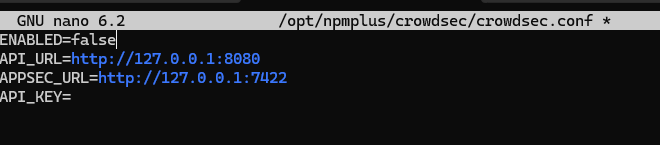
*crowdsec.conf prior to editing - ENABLED and API_KEY fields still at their default/placeholder state.*

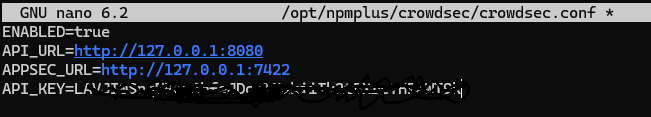
*crowdsec.conf after editing - ENABLED=true and API_KEY populated with the bouncer's key.*

#### Step 6: Investigate an Inconsistent Block Result

Re-sending the original two payloads after enabling the WAF produced an unexpected, inconsistent result: the XSS payload was blocked ('403 Forbidden'), but the SQL injection payload still returned '200 OK', despite CrowdSec's own alert log showing both had been detected with an identical anomaly score of 40.

'''bash
sudo docker exec crowdsec cscli alerts list
'''

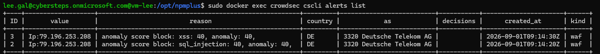
*CrowdSec alert log showing both attacks detected (anomaly score 40) but with no active "decisions" recorded for either - the first clue that detection and enforcement were not yet aligned.*

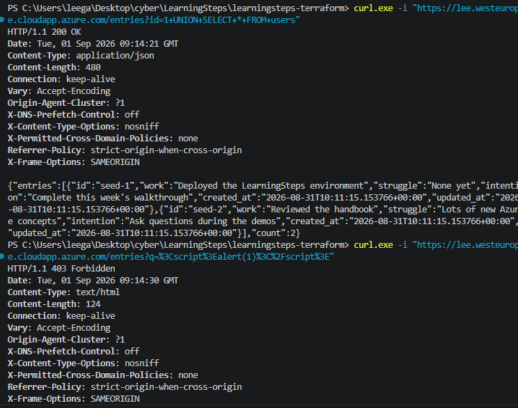
*Re-test after enabling the WAF: the XSS payload returns 403 Forbidden, while the SQL injection payload still returns 200 OK.*

To diagnose this, the AppSec configuration files inside the CrowdSec container were inspected, to check whether SQL injection detection was running out-of-band (log-only) rather than in-band (blocking):

'''bash
sudo docker exec crowdsec cat /etc/crowdsec/appsec-configs/crs-inband.yaml
sudo docker exec crowdsec cat /etc/crowdsec/appsec-configs/crs.yaml
'''

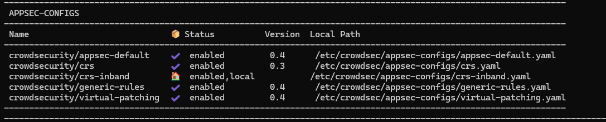
*Both the in-band (blocking) and out-of-band (alert-only) AppSec configs reference the same crowdsecurity/crs ruleset - ruling out a pipeline/routing misconfiguration.*

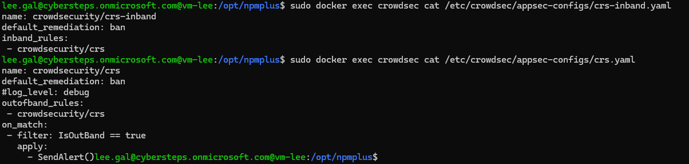
*Investigation into the CRS ruleset behavior to isolate why one payload type was blocked and the other was not.*

#### Step 7: Root Cause - Encoding-Sensitive Rule Matching

The two original payloads differed in how they encoded spaces: the SQL injection payload used literal '+' characters, while the XSS payload used standard percent-encoding throughout. Re-sending the SQL injection payload with proper percent-encoding ('%20') instead of '+' resulted in an immediate block:

'''powershell
curl.exe -i "https://lee.westeurope.cloudapp.azure.com/entries?id=1%20UNION%20SELECT%20*%20FROM%20users"
'''

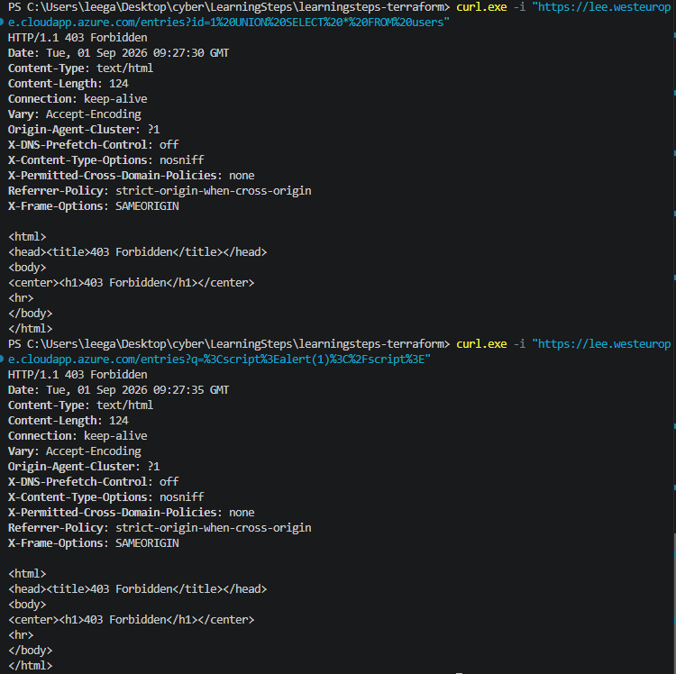
*The percent-encoded SQL injection payload is now blocked with 403 Forbidden, confirming the root cause was encoding-sensitive signature matching rather than a configuration fault.*

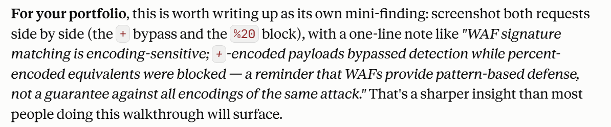
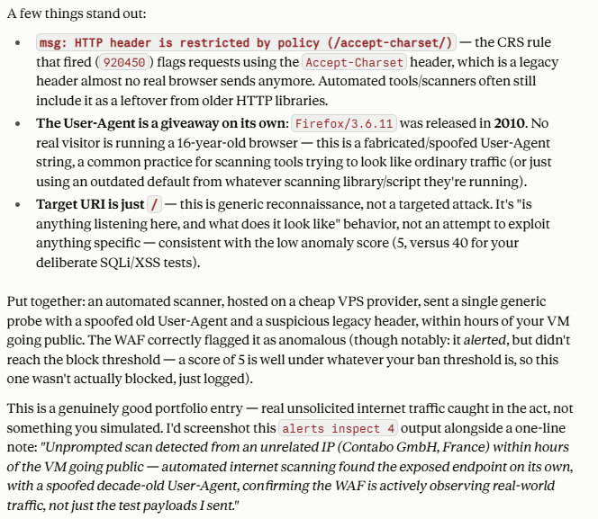
*Written explanation of the finding: '+' is a valid alternate encoding for a space in a URL query string and is decoded identically by the application, but the WAF's pattern-matching rule for this attack signature did not recognize the '+' form in real time, allowing a logically identical attack to bypass detection while its percent-encoded equivalent was blocked.*

'''bash
sudo docker exec crowdsec cscli alerts list
'''

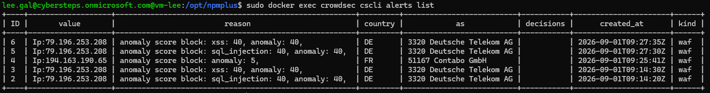
*Final alert list showing all four requests logged: the original '+'-encoded payloads (detected, not blocked) alongside the percent-encoded equivalents (detected and blocked).*

#### Step 8: Unplanned Finding - Real Internet Scan Traffic

While reviewing the alert log, a fifth, unrelated entry was found originating from '194.163.190.65' (Contabo GmbH, France) - an IP not used at any point during this exercise. Inspecting the alert showed a generic reconnaissance probe (target URI '/', low anomaly score of 5) sent with a User-Agent string identifying itself as Firefox 3.6.11, a browser version released in 2010 - strongly suggesting an automated scanning tool rather than a real visitor.

'''bash
sudo docker exec crowdsec cscli alerts inspect 4
'''

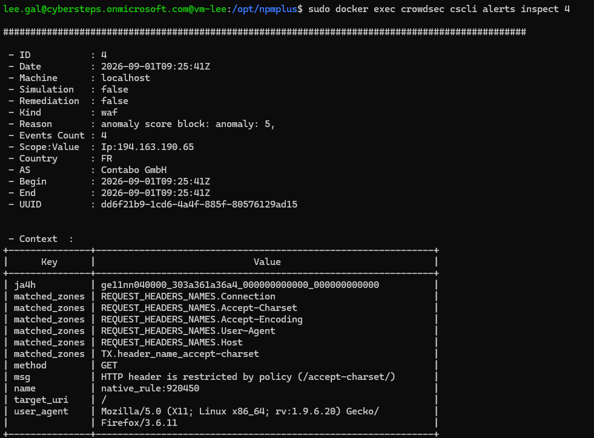
*Detailed inspection of the unsolicited scan: an unrelated IP hosted by Contabo GmbH probed the application's root path within hours of it becoming public, using a spoofed, obsolete User-Agent string.*

> This was not a simulated test - it is unprompted traffic from the open internet, and stands as direct evidence that a publicly reachable endpoint is discovered and probed by automated actors almost immediately after exposure, independent of any action taken by the operator.

#### Step 9: Reviewing CrowdSec's Data-Sharing Default

Before closing out Day 2, CrowdSec's community threat-intel sharing setting was checked, since it is enabled by default and shares detected attack signals with CrowdSec's central network:

'''bash
sudo docker exec crowdsec cscli console status
'''

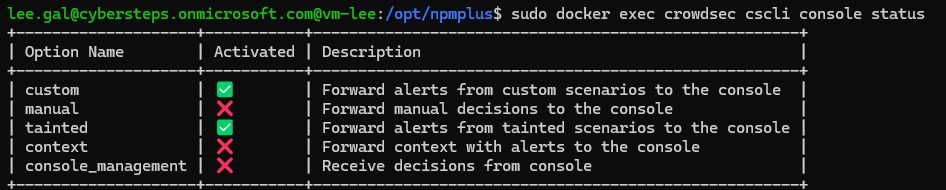
*Checking whether community threat-intel sharing is active, and making a deliberate decision on whether to keep it enabled for this environment.*

---

## 4. Analysis & Submission Questions

**Why is RBAC required in addition to a managed identity and the AADSSHLoginForLinux extension?**
Azure separates the management plane (control over cloud resources, e.g. Owner/Contributor) from the data plane (logging into the operating system itself). Even full subscription ownership does not grant OS-level login rights; the Virtual Machine Administrator Login role must be explicitly assigned, scoped to the specific VM resource, to close this gap deliberately rather than by default.

**Why must the NSG rule specify /32 rather than the bare IP address?**
'/32' in CIDR notation means "exactly one address, no range" - this is what restricts the rule to a single trusted host rather than an entire subnet.

**Why did the plain HTTP request return 301 instead of the JSON response after Step 4?**
Enabling Force HTTPS configures the reverse proxy to issue an HTTP redirect (301 Moved Permanently) for any request arriving unencrypted, rather than serving the response directly - ensuring no client can be served content over an unencrypted channel even by mistake.

**Why did one attack payload bypass the WAF while an equivalent one did not?**
The WAF's signature-matching rules for the SQL injection attack category did not recognize '+' as an equivalent encoding of a space, even though the backend application decodes '+' and '%20' identically. This is a real, known class of WAF-bypass technique (encoding-based evasion) and demonstrates that pattern/signature-based defenses provide probabilistic, not absolute, protection.

**Does the WAF bypass mean the application itself is vulnerable to SQL injection?**
Not necessarily, and this is an important distinction: the WAF is one layer of defense, separate from whether the application's own code uses parameterized queries (safe) or constructs raw SQL (exploitable). A WAF failing to block a payload does not, by itself, prove the underlying application is vulnerable - it only means that if the application were vulnerable, this specific bypass could reach it without being flagged in real time.

### Explanation

Together, Day 1 and Day 2 demonstrate the principle of defense in depth applied to two different layers of the same system. Day 1 addressed the management plane: an identity-based, network-restricted SSH path replaced a globally reachable, key-based one, removing the most heavily automated class of internet attack (credential brute-forcing) as a viable path into the VM. Day 2 addressed the application's public-facing layer in three stages that build on one another - a public entry point was created, that entry point was encrypted end-to-end with a trusted certificate, and a Web Application Firewall was layered on top to inspect and block malicious request patterns before they reach the application code.

The exercise also surfaced two findings beyond the prescribed steps that reinforce this principle in practice rather than theory. The WAF encoding bypass showed that a security control can be correctly enabled, correctly configured, and still have exploitable gaps in its own detection logic - meaning a defender should verify a control's actual behavior against varied inputs rather than trusting that "enabled" means "complete protection." The unsolicited scan from Contabo GmbH showed that this is not a hypothetical concern: real automated reconnaissance reached this environment within hours of it becoming reachable at all, independent of anything the operator did to attract attention. Both findings support the same underlying lesson of the exercise: every layer of defense reduces risk, but no single layer - and no single day's work - eliminates it entirely.