Note: This is the lab report. For app deployment instructions, see Base Deployment instead.

# LearningSteps Lockdown

**Student Name:** Lee Gal

**Date:** 01.09.26

**Module Name:** Module3. Cloud

**Exercise:** LearningSteps Lockdown

---

## 1. Summary of Findings

This project I worked on hardening the LearningSteps environment, a FastAPI app with a PostgreSQL database running on Azure, deployed with Terraform. When I started, almost nothing was protected. SSH was open to any IP, the app had no encryption or WAF, the API accepted requests from anyone with no login at all, and the database was reachable straight from the public internet with a wide open firewall rule.

Over the four days I locked each of these down one at a time. First I replaced the open SSH access with identity based login through Entra ID and restricted the network rule to my own IP. Then I gave the app a real public entry point with TLS and a web application firewall. After that I put an identity gate in front of the API so requests need a valid Entra ID login before they reach the app at all. Finally I moved the database off the public internet completely, using a proper backup first migration instead of just flipping a setting.

Along the way I ran into a lot of real problems that were not just following the handbook step by step. I found a way to sneak a SQL injection payload past the WAF just by encoding spaces as `+` instead of `%20`. I saw an actual unrelated scanner hit my VM from an IP in France a few hours after it went public. I hit a tenant naming collision that gave a misleading permissions error, a missing email claim that broke my login with a 500 error, and a case where the WAF was blocking its own admin panel. None of these were planned, they came up while I was working through the demos, and figuring them out helped me actually understand why each layer exists rather than just typing commands from a page.

## 2. Tools & Environment

- Operating System (client): Windows 11
- Cloud Provider: Microsoft Azure
- Infrastructure as Code: Terraform
- CLI Tools: Azure CLI (az), PowerShell, OpenSSH for Windows, curl.exe
- Target VM: Ubuntu 22.04 LTS (vm-lee), Azure Linux Virtual Machine
- Identity: Microsoft Entra ID (Azure AD), Virtual Machine Administrator Login role
- Reverse Proxy / Certificate Management: NPMplus (Nginx Proxy Manager, extended build)
- TLS Certificate Authority: Let's Encrypt
- Web Application Firewall: CrowdSec (OWASP Core Rule Set, AppSec component)
- Database: Azure Database for PostgreSQL Flexible Server (psql-lee)
- Version Control: Git / GitHub Desktop

## 3. Execution & Procedures

### Locking down SSH access

The first thing I looked at was how the VM could be reached. Terraform had already set up a system assigned managed identity on the VM and installed the AADSSHLoginForLinux extension, so most of the plumbing for identity based login was already there. What was missing was the actual role assignment. Just being Owner on the subscription is not enough to log into a VM's operating system, Azure keeps that as a separate permission, so I had to explicitly grant myself the Virtual Machine Administrator Login role scoped to the VM.

```powershell
$VM_ID = az vm show --resource-group rg-lee --name vm-lee --query id -o tsv
az role assignment create --assignee lee.gal@cybersteps.onmicrosoft.com `
  --role "Virtual Machine Administrator Login" --scope $VM_ID
```


This confirms the role landed correctly on the VM resource.

Once that was in place I could log in with my own identity instead of a key file.

```powershell
az ssh vm --resource-group rg-lee --name vm-lee
```

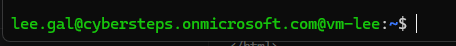

The second part of locking this down was the network side. The NSG rule for SSH originally allowed traffic from any IP at all, which is basically an open invitation for brute force bots that scan the internet for port 22 constantly.


I got my own public IP and updated the rule so only that address could reach SSH.

```powershell
curl.exe -s -4 ifconfig.me
# -> e.g. 79.196.253.208

# network.tf
source_address_prefix = "79.196.253.208/32"
```


The `/32` at the end matters, it means exactly one address and not a whole range.

```powershell
terraform apply
```


One thing I ran into more than once during the week is that my home IP changes between sessions since it is not static. A few times I came back to work on the project and got a connection timeout on SSH, which turned out to just be my ISP handing me a new IP. The fix each time was checking ifconfig.me again and updating the rule, which became a normal part of starting a session rather than something surprising by the end of the week.

### Encryption and a web application firewall

With SSH locked down I moved on to the app itself, which had no public entry point yet at all. Before touching anything public I used the SSH access from the day before to open a tunnel and confirm the app was actually running.

```powershell
az ssh config --resource-group rg-lee --name vm-lee --file azssh_config
ssh -F azssh_config -L 8000:localhost:8000 <vm-ip>
```


```powershell
curl.exe http://localhost:8000/entries
```


The seeded journal entries came back fine, so the app itself was healthy, it just was not reachable from outside yet.

I created a Proxy Host in NPMplus pointing the VM's public domain at the app's internal port, leaving TLS off for the moment on purpose.


To actually see the problem before fixing it, I sent a plain HTTP request and watched the whole response come back in the clear.

```powershell
curl.exe -i "http://lee.westeurope.cloudapp.azure.com/entries"
```


Anyone sitting on the same network path could have read that. I requested a real Let's Encrypt certificate through the NPMplus panel and turned on Force HTTPS so plain HTTP would redirect instead of being served.


```powershell
curl.exe -i https://lee.westeurope.cloudapp.azure.com/entries
curl.exe -i "http://lee.westeurope.cloudapp.azure.com/entries"
```


After that I turned to the WAF. First I confirmed there was nothing stopping an attack payload from getting through at all.

```powershell
curl.exe -i "https://lee.westeurope.cloudapp.azure.com/entries?id=1+UNION+SELECT+*+FROM+users"
curl.exe -i "https://lee.westeurope.cloudapp.azure.com/entries?q=%3Cscript%3Ealert(1)%3C%2Fscript%3E"
```


Both a SQL injection style payload and an XSS payload went straight through with a normal 200 response. I registered CrowdSec's bouncer against NPMplus, which gave me a one time API key I had to paste into the config right away since it cannot be viewed again.

```bash
sudo docker exec crowdsec cscli bouncers add npmplus
```


```bash
sudo nano /opt/npmplus/crowdsec/crowdsec.conf
#   ENABLED=true
#   API_URL=http://127.0.0.1:8080
#   APPSEC_URL=http://127.0.0.1:7422
#   API_KEY=<redacted>

cd /opt/npmplus && sudo docker compose restart npmplus
```


When I re-sent the same two payloads after this, I got a result I did not expect. The XSS one was blocked with a 403 like it should be, but the SQL injection one still came back 200, even though CrowdSec's own alert log showed both had been picked up with the exact same anomaly score.

```bash
sudo docker exec crowdsec cscli alerts list
```


I spent a while checking whether the SQL injection detection was somehow only running in an out of band, alert only mode instead of actually blocking.

```bash
sudo docker exec crowdsec cat /etc/crowdsec/appsec-configs/crs-inband.yaml
sudo docker exec crowdsec cat /etc/crowdsec/appsec-configs/crs.yaml
```


Both configs pointed at the same ruleset, so that was not it. Looking closer at the two payloads, I noticed they encoded spaces differently. The SQL injection one used plain `+` characters and the XSS one used proper percent encoding all the way through. I tried sending the SQL injection payload again but with `%20` instead of `+`, and it was blocked immediately.

```powershell
curl.exe -i "https://lee.westeurope.cloudapp.azure.com/entries?id=1%20UNION%20SELECT%20*%20FROM%20users"
```


So the actual issue was that the WAF's rule for this attack pattern was not recognizing `+` as an equivalent to a space, even though the app itself decodes them identically. This does not mean the app is definitely vulnerable to SQL injection, that depends on whether the backend code uses parameterized queries or not, but it does mean this specific WAF rule had a real, exploitable blind spot based purely on how the attacker encodes the request. It was a genuinely useful thing to stumble into, since it shows a WAF being switched on and correctly configured is not the same thing as a WAF catching everything.

```bash
sudo docker exec crowdsec cscli alerts list
```


While I was in the alert log I noticed a fifth entry I had not caused myself, from an IP in France belonging to a hosting company called Contabo. It was a generic probe against the root path with a low anomaly score, sent with a User-Agent claiming to be Firefox from 2010, which is not something a real visitor would ever actually send. This was an unprompted scan from the open internet, not something I triggered, and it happened within hours of the environment going public. It was a good reminder that exposing something publicly gets it found by automated scanners almost immediately, regardless of anything I do.

```bash
sudo docker exec crowdsec cscli alerts inspect 4
```


Before moving on I also checked CrowdSec's community sharing setting, since it shares detected attack data with CrowdSec's network by default and I wanted to actually look at that rather than assume it was fine.

```bash
sudo docker exec crowdsec cscli console status
```


### Putting an identity gate in front of the API

By this point the app had encryption and a WAF, but it still accepted requests from literally anyone with no login at all. The goal here was to put oauth2-proxy behind NPMplus so nothing reaches the app without a valid Entra ID token.

The first attempt to register an Entra ID application for this failed right away.

```powershell
$APP_ID = az ad app create --display-name learningsteps-oauth2-proxy `
    --sign-in-audience AzureADMyOrg `
    --query appId -o tsv
```

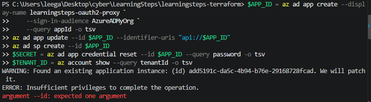

The error said insufficient privileges, which made me think I was missing an Entra role. After checking, it turned out this was not actually a permissions problem at all. Since this is a shared classroom tenant, someone else had already registered an app with the exact same display name, and the CLI tried to patch that existing app instead of creating a new one for me.

```powershell
az ad app list --display-name learningsteps-oauth2-proxy --query "[].{DisplayName:displayName, AppId:appId, ObjectId:id}" -o table
az ad app owner list --id <ObjectId> --query "[].userPrincipalName" -o tsv
```

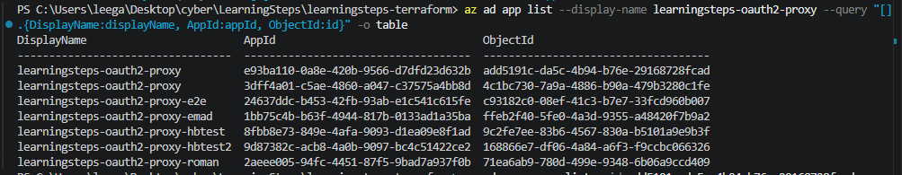

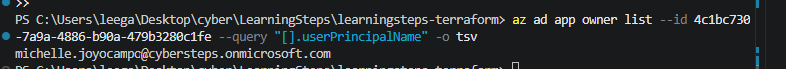

Neither existing app belonged to me, one had no owner at all and the other belonged to a classmate. Using a unique display name fixed it right away, no role changes needed.

```powershell
$APP_ID = az ad app create --display-name learningsteps-oauth2-proxy-lee `
    --sign-in-audience AzureADMyOrg `
    --query appId -o tsv
az ad app update --id $APP_ID --identifier-uris "api://$APP_ID"
az ad sp create --id $APP_ID
$SECRET = az ad app credential reset --id $APP_ID --query password -o tsv
$TENANT_ID = az account show --query tenantId -o tsv
```

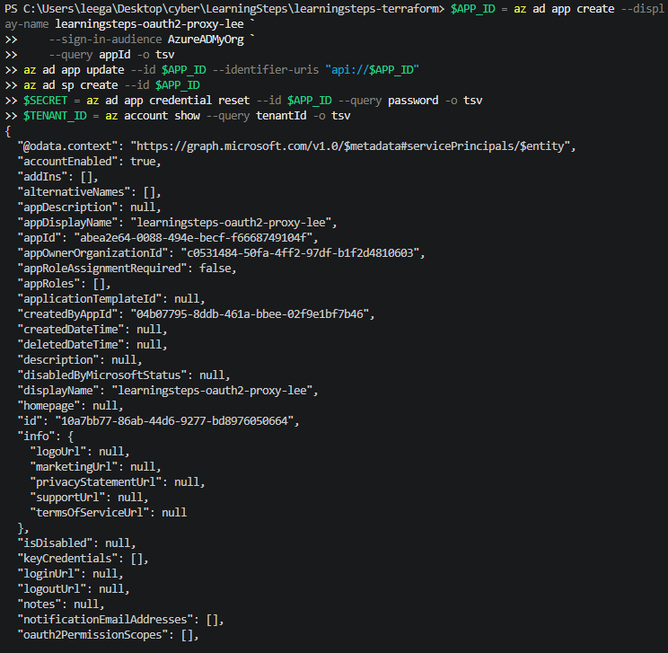

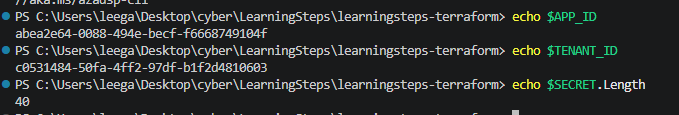

Two more setup steps, forcing v2.0 format tokens and exposing an API scope with a redirect URL, kept failing with Bad Request errors because az rest was not sending a Content-Type header automatically on Windows.

```powershell
az rest --method PATCH --uri "https://graph.microsoft.com/v1.0/applications/$OBJECT_ID" `
  --headers "Content-Type=application/json" `
  --body '{"api":{"requestedAccessTokenVersion":2}}'
```

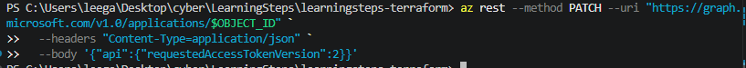

Setting the header explicitly fixed most of it, but the redirect URL update still failed even after that, this time because of how az ad app update handles inline JSON on Windows. Writing the JSON to a file first and passing that in instead solved it.

```powershell
$redirectBody | Out-File -FilePath redirect.json -Encoding utf8 -NoNewline
az rest --method PATCH --uri "https://graph.microsoft.com/v1.0/applications/$OBJECT_ID" `
  --headers "Content-Type=application/json" `
  --body "@redirect.json"
```

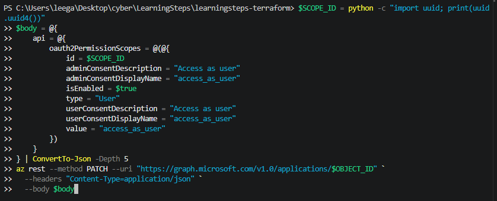

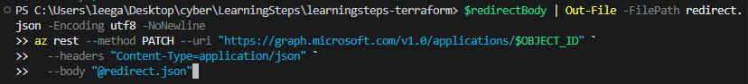

With the app registration sorted, I confirmed oauth2-proxy was already installed on the VM but sitting idle, waiting for real credentials.

```bash
systemctl is-active oauth2-proxy
```

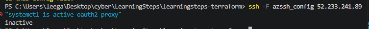

I filled in the real values and started it.

```bash
sudo sed -i \
  -e "s#^OAUTH2_PROXY_CLIENT_ID=.*#OAUTH2_PROXY_CLIENT_ID=<app-id>#" \
  -e "s#^OAUTH2_PROXY_CLIENT_SECRET=.*#OAUTH2_PROXY_CLIENT_SECRET=<client-secret>#" \
  -e "s#^OAUTH2_PROXY_OIDC_ISSUER_URL=.*#OAUTH2_PROXY_OIDC_ISSUER_URL=https://login.microsoftonline.com/<tenant-id>/v2.0#" \
  -e "s#^OAUTH2_PROXY_OIDC_EXTRA_AUDIENCES=.*#OAUTH2_PROXY_OIDC_EXTRA_AUDIENCES=api://<app-id>#" \
  /etc/oauth2-proxy/oauth2-proxy.env

sudo sed -i "s#REPLACE_WITH_DOMAIN#lee.westeurope.cloudapp.azure.com#" /etc/systemd/system/oauth2-proxy.service
sudo systemctl daemon-reload
sudo systemctl enable --now oauth2-proxy
```

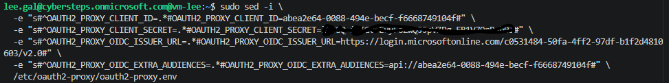

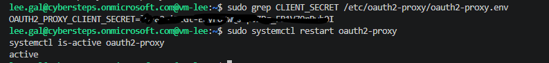

At one point along the way I had only looked at the secret value with echo but never actually pasted it into the VM's config before starting the service, so it came up active while still holding an old, invalid secret. Checking the actual deployed value with grep instead of trusting that "active" meant "correct" caught this before it caused confusion later. A service reporting active only means it started, not that its settings are right.

Next I tried wiring the Auth Request setting into NPMplus so it would actually enforce the login, and saving that setting failed with a strange error about invalid JSON.

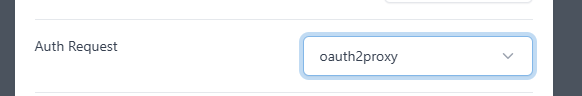

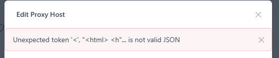

There was also a new field called Auth Request Upstream that the handbook did not mention, which I confirmed was safe to leave empty since the upstream address was already set as an environment variable on the container.

```bash
sudo docker exec npmplus env | grep -i AUTH_REQUEST
```

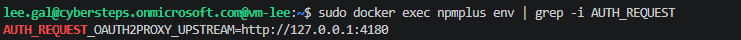

Checking NPMplus's own logs showed what was really happening, CrowdSec's WAF was blocking NPMplus's own request to save the setting, since my SSH tunnel's traffic shows up as 127.0.0.1 and that address had been banned earlier from testing.

```bash
sudo docker logs npmplus --tail 30
```

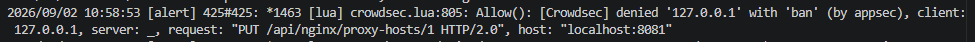

The fix was to disable CrowdSec briefly, save the setting, then turn it back on.

```bash
sudo sed -i 's/^ENABLED=.*/ENABLED=false/' /opt/npmplus/crowdsec/crowdsec.conf
cd /opt/npmplus && sudo docker compose restart npmplus
# saved the setting here
sudo sed -i 's/^ENABLED=.*/ENABLED=true/' /opt/npmplus/crowdsec/crowdsec.conf
cd /opt/npmplus && sudo docker compose restart npmplus
```

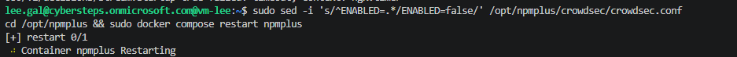

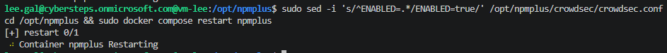

With that sorted I tested the gate itself. Sending no token at all, and sending a made up bearer token, both got redirected to Microsoft sign in the same way, so a fake token gets no special treatment.

```powershell
curl.exe -i https://lee.westeurope.cloudapp.azure.com/
curl.exe -i -H "Authorization: Bearer garbage" https://lee.westeurope.cloudapp.azure.com/
```

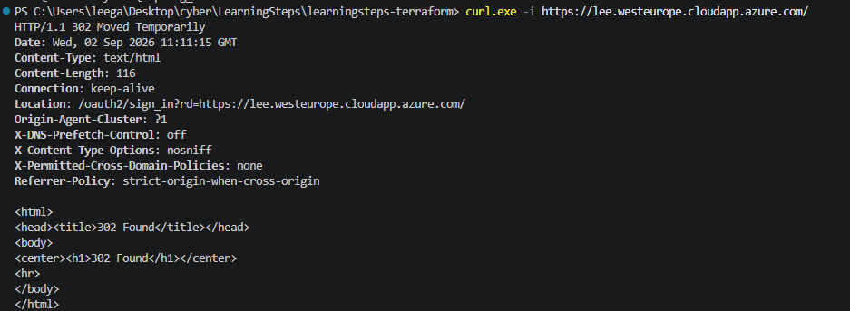

A real browser login was more of a fight than I expected. It got past the actual Microsoft sign in screen fine, then came back with a 500 error.

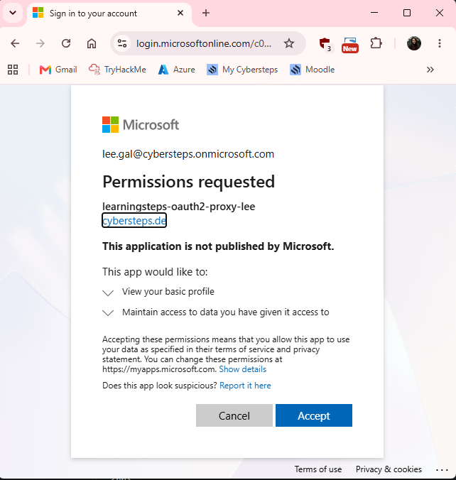

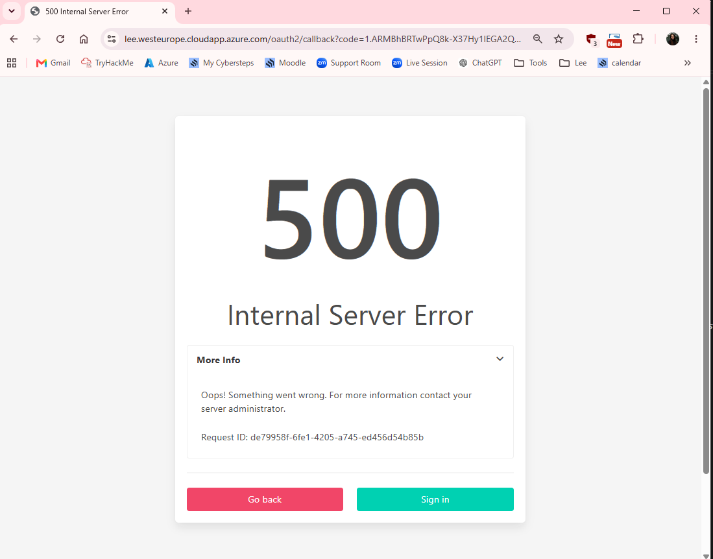

The logs pointed straight at the cause, neither the id_token nor the profile URL had set an email, meaning oauth2-proxy could not figure out who I was from the token even though I had just logged in successfully.

```bash
sudo journalctl -u oauth2-proxy -n 50 --no-pager
```

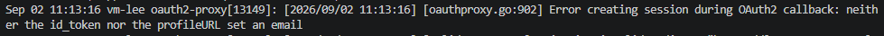

The classroom account just does not populate a normal email claim in its token. I mapped identity to the preferred_username claim instead, which is reliably filled in for this kind of account.

```bash
sudo bash -c 'cat >> /etc/oauth2-proxy/oauth2-proxy.env << EOF
OAUTH2_PROXY_OIDC_EMAIL_CLAIM=preferred_username
OAUTH2_PROXY_INSECURE_OIDC_ALLOW_UNVERIFIED_EMAIL=true
OAUTH2_PROXY_WHITELIST_DOMAIN=lee.westeurope.cloudapp.azure.com
EOF'
sudo systemctl restart oauth2-proxy
```

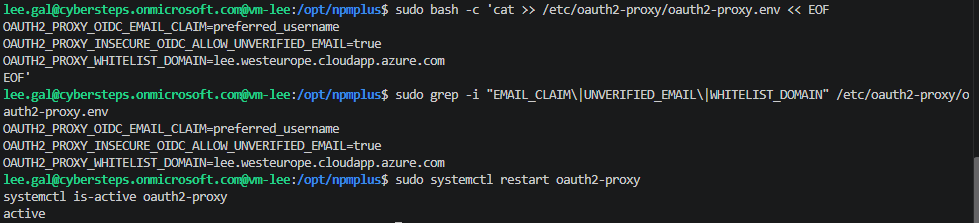

After that a fresh login worked properly.

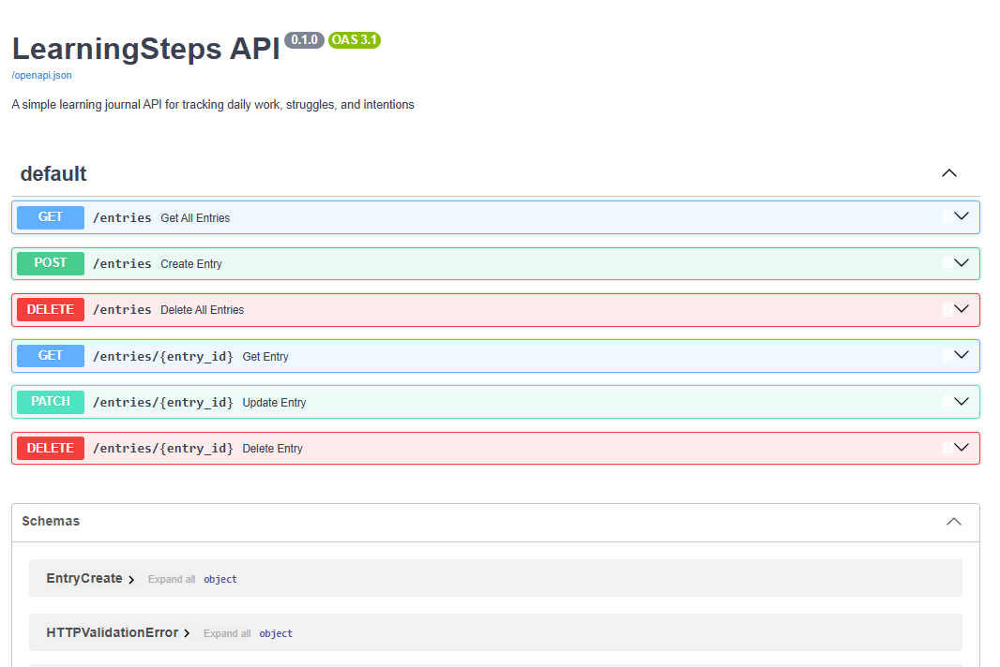

Last thing for this part was checking whether the WAF still mattered now that there was an identity gate too. I sent the same SQL injection payload from before, but without logging in first.

```powershell
curl.exe -i "https://lee.westeurope.cloudapp.azure.com/entries?id=1+UNION+SELECT+*+FROM+users"
```

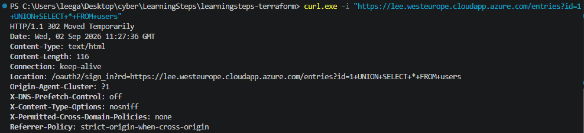

Instead of the 403 it gave before, it now redirected to login with a 302, since the identity check runs first and an anonymous request never even reaches the WAF anymore. Then I pasted the exact same URL into my browser tab where I was already logged in.

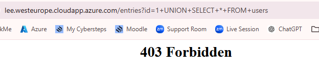

That one still got blocked with a 403, which shows the WAF is still doing its job, it just only sees traffic that already got past the login check. That is basically the whole point of this part, identity checks who is asking and the WAF checks whether what they are asking for looks malicious, and you need both because each one only catches what the other cannot.

### Moving the database off the public internet

The database had been public since the very first deployment, with a firewall rule that let in every single IP address, `0.0.0.0` to `255.255.255.255`. The goal was to move it fully behind the VNet so only the VM can reach it, and to actually practice doing this the safe way with a backup first.

I confirmed the database really was open to the world by connecting to it straight from a client, no VM or tunnel involved.

```bash
psql "host=psql-lee.postgres.database.azure.com user=psqladmin dbname=learning_journal sslmode=require"
```

My own Windows machine's psql client got blocked from even launching by Windows Smart App Control, and there was no clear way to unblock it without a full Windows reset, so I ran this from Azure Cloud Shell instead. That still proves the same thing the demo is asking for, since Cloud Shell is outside the VNet just like any other random machine on the internet would be.

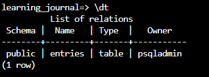

Before touching anything I checked my local pg_dump version matched closely enough to the server, then took an actual backup.

```bash
pg_dump --version
```

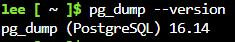

```bash
pg_dump "postgresql://psqladmin@psql-lee.postgres.database.azure.com/learning_journal?sslmode=require" > learningsteps_backup.sql
ls -lh learningsteps_backup.sql
```

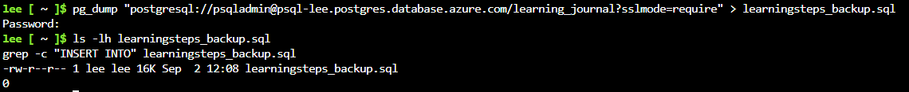

I made sure the file was not empty before doing anything destructive, since there is no undo once the migration runs. I downloaded it to my own machine to use later.

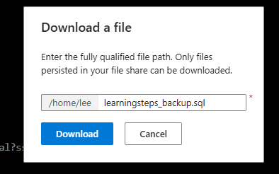

With the backup confirmed safe I made the actual Terraform changes, adding a delegated subnet and a private DNS zone in network.tf, and removing the open firewall rule from postgresql.tf while setting public access to false.

```hcl
resource "azurerm_subnet" "db" {
  name                 = "snet-db"
  resource_group_name  = azurerm_resource_group.main.name
  virtual_network_name = azurerm_virtual_network.main.name
  address_prefixes     = ["10.0.2.0/24"]

  delegation {
    name = "postgresql"
    service_delegation {
      name    = "Microsoft.DBforPostgreSQL/flexibleServers"
      actions = ["Microsoft.Network/virtualNetworks/subnets/join/action"]
    }
  }
}

resource "azurerm_private_dns_zone" "postgres" {
  name                = "privatelink.postgres.database.azure.com"
  resource_group_name = azurerm_resource_group.main.name
}

resource "azurerm_private_dns_zone_virtual_network_link" "postgres" {
  name                  = "postgres-dns-link"
  resource_group_name   = azurerm_resource_group.main.name
  private_dns_zone_name = azurerm_private_dns_zone.postgres.name
  virtual_network_id    = azurerm_virtual_network.main.id
}
```

```hcl
  public_network_access_enabled = false
  delegated_subnet_id           = azurerm_subnet.db.id
  private_dns_zone_id           = azurerm_private_dns_zone.postgres.id
  depends_on                    = [azurerm_private_dns_zone_virtual_network_link.postgres]
```

I also had to update vm.tf so it no longer referenced the firewall rule I was deleting, otherwise apply would fail immediately.

```bash
terraform plan
```

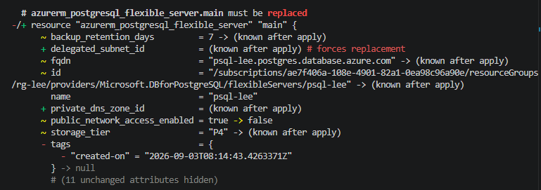

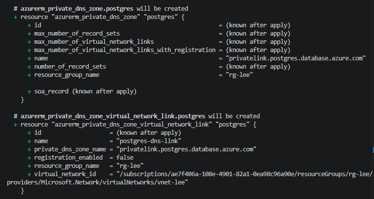

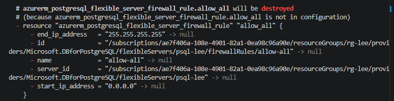

The plan showed the database itself getting destroyed and recreated, which makes sense since networking mode is set at creation time and cannot just be changed on a live server. Importantly the VM only showed an in place tag update, not a replacement, so the whole Docker, NPMplus, CrowdSec, oauth2-proxy setup from the earlier days was not going to be touched.

```bash
terraform apply
```

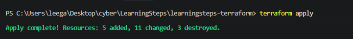

Once the database was private, I had to restore from the VM instead of my laptop, since that is the only thing sitting inside the VNet now.

```bash
scp -F azssh_config learningsteps_backup.sql <vm-ip>:/tmp/
```

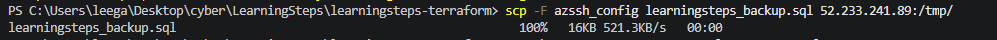

```bash
psql "host=psql-lee.postgres.database.azure.com user=psqladmin dbname=learning_journal sslmode=require" -f /tmp/learningsteps_backup.sql
```

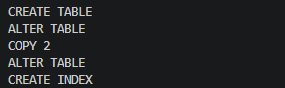

The restore printed a lot of warnings about privileges not being granted, but those are just about internal PostgreSQL system objects that Azure's managed service does not let you re-grant, they do not affect the actual application data. The important line was COPY 2, confirming both seeded journal entries came back.

To check the isolation actually worked, I ran the exact same connection attempt from before, from outside the VNet.

```bash
psql "host=psql-lee.postgres.database.azure.com user=psqladmin dbname=learning_journal sslmode=require"
```

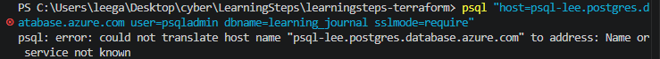

This time the hostname did not even resolve, which is a stronger result than just getting refused, since the private DNS zone serving that name simply does not exist outside the virtual network at all.

Last check was making sure the app itself actually still worked, not just that the database existed somewhere.

```
https://lee.westeurope.cloudapp.azure.com/entries
```

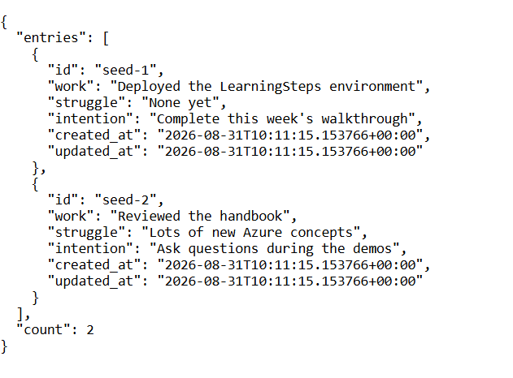

Both journal entries came back exactly as before. The app's connection string was built from the fixed server name rather than a live attribute tied to the old database, which is why it kept working without me needing to change anything on the app side after the database got replaced underneath it.

## 4. Explanation

Looking back at the whole week, each part closed a different gap and mostly built on the one before it. Locking down SSH first meant that everything I did afterward, tunneling in to check the app, running commands on the VM, restoring the database, all happened over a channel that was already identity verified rather than a shared key. Adding TLS and the WAF gave the app a public entry point that was actually safe to expose, and having HTTPS working was what let the identity gate later on even function, since Entra ID will not accept a plain HTTP reply URL. Putting the identity gate in front of the API meant that by the time I moved the database, an attacker would have already had to get past two separate layers just to reach the point where the database mattered at all.

None of these layers do the same job as each other. SSH lockdown protects the machine's management access, TLS protects the traffic in transit, the WAF looks at what a request contains, the identity gate checks who is sending it, and the database isolation limits which resources can even reach the database over the network. Removing any one of them leaves a different kind of gap that the others do not cover, which is really the whole point of doing this in layers instead of picking just one control and calling it done.

The parts I found most useful were not the steps that went smoothly, they were the ones that broke in some way I had to actually figure out. The WAF letting through a `+` encoded SQL injection while blocking the `%20` version showed me that having a security tool switched on and configured correctly still does not guarantee it catches everything, since it only catches what its rules are actually written to recognize. Watching a real scanner from an unrelated IP show up in the logs within hours of the app going public made the idea that the internet is scanning you constantly feel real instead of theoretical. And the misleading insufficient privileges error partway through was a good reminder to actually check what is happening with read only commands before assuming the first explanation is the right one, since the real cause turned out to be a naming collision and had nothing to do with permissions at all.
